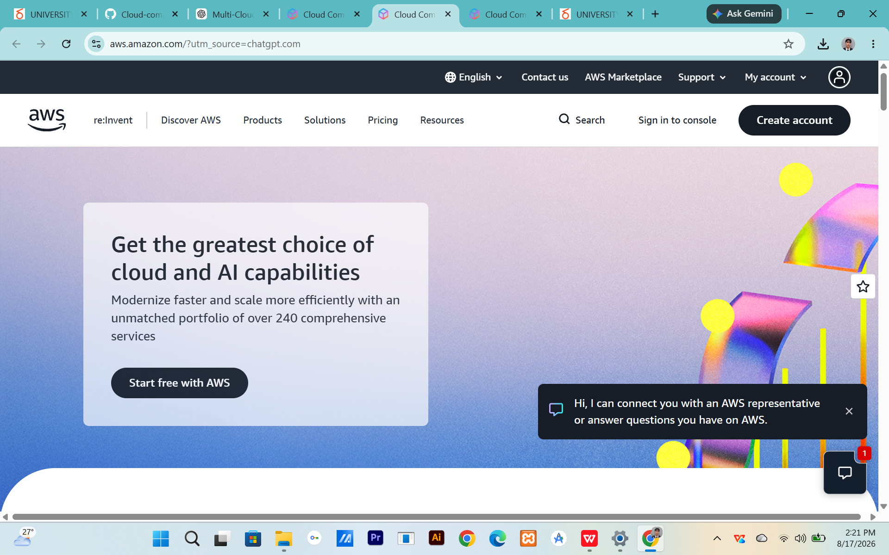

# Amazon Web Services (AWS) Research

## Brief Overview

## Global Infrastructure

## Cloud Management Console

## Four Core Services

### 1. Amazon EC2

### 2. Amazon S3

### 3. Amazon RDS

### 4. AWS IAM

## Three Advantages

1. 
2. 
3. 

## Typical Enterprise Use Cases

1. 
2. 
3. 

## Screenshot

