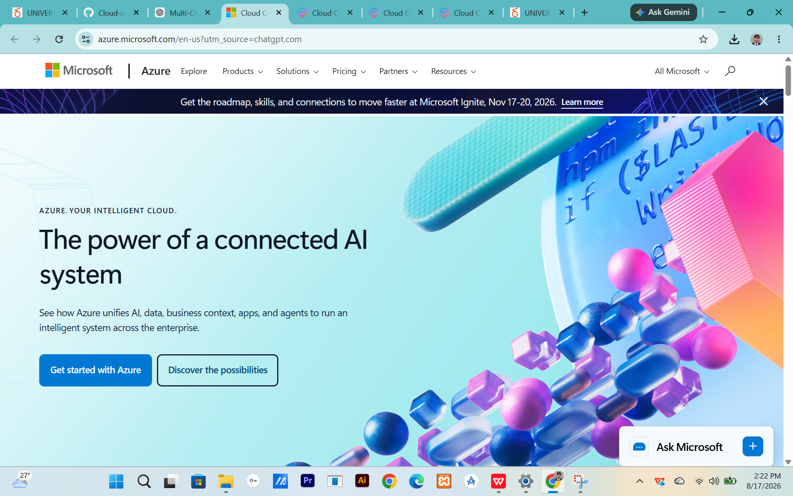

# Microsoft Azure Research

## Brief Overview

## Global Infrastructure

## Cloud Management Console

## Four Core Services

### 1. Azure Virtual Machines

### 2. Azure Blob Storage

### 3. Azure SQL Database

### 4. Microsoft Entra ID

## Three Advantages

1.
2.
3.

## Typical Enterprise Use Cases

1.
2.
3.

## Screenshot

