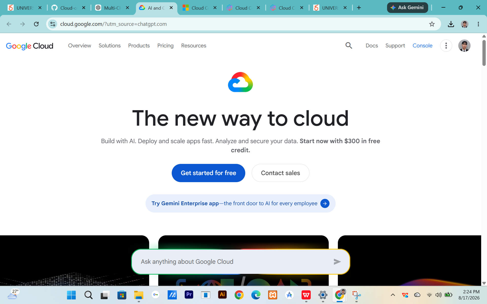

# Google Cloud Platform (GCP) Research

## Brief Overview

## Global Infrastructure

## Cloud Management Console

## Four Core Services

### 1. Compute Engine

### 2. Cloud Storage

### 3. Cloud SQL

### 4. Google Cloud IAM

## Three Advantages

1.
2.
3.

## Typical Enterprise Use Cases

1.
2.
3.

## Screenshot

